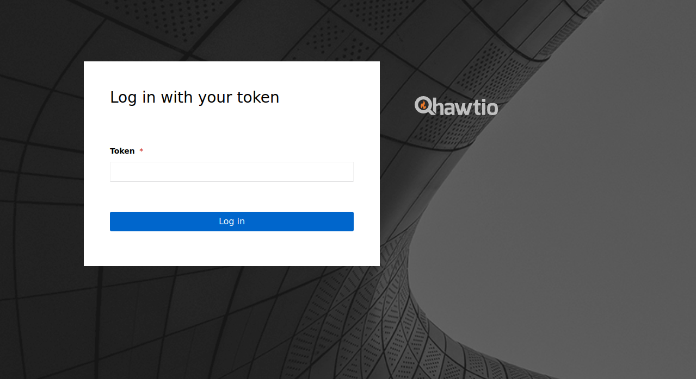

# Creating a Hawtio user for Form authentication

If you install Hawtio on Kubernetes or choose to use Form authentication, you need a user with a bearer token to log in to the console. There are [different ways](https://kubernetes.io/docs/reference/access-authn-authz/authentication/) to create or provide users with bearer tokens.

This doc illustrates how to create a `ServiceAccount` as a user to log in to the Hawtio console.

## Creating a ServiceAccount

First, create a `ServiceAccount` named `hawtio-user` in the namespace you installed Hawtio.

```sh
$ cat <<EOF | kubectl apply -f -
apiVersion: v1
kind: ServiceAccount
metadata:
  name: hawtio-user
  namespace: hawtio
EOF
```

## Creating a RoleBinding/ClusterRoleBinding

Next, assign the user with an appropriate role by creating a `RoleBinding` or `ClusterRoleBinding` respectively depending on the [deployment mode](../README.md#deployment) you chose. For more information on RBAC, see [RBAC](./rbac.md).

Here we use `cluster-admin` cluster role for demonstrative purposes. Note that this role gives a user maximum permissions and should be used in development only. In general it is recommended to use a more restrictive role in practice.

```sh
$ cat <<EOF | kubectl apply -f -
apiVersion: rbac.authorization.k8s.io/v1
kind: ClusterRoleBinding
metadata:
  name: hawtio-user
roleRef:
  apiGroup: rbac.authorization.k8s.io
  kind: ClusterRole
  name: cluster-admin
subjects:
- kind: ServiceAccount
  name: hawtio-user
  namespace: hawtio
EOF
```

## Getting a bearer token

Finally, get the bearer token for the user with the following command:

```sh
$ kubectl -n hawtio get secrets $(kubectl -n hawtio get sa hawtio-user -o jsonpath="{.secrets[0].name}") \
        -o go-template="{{.data.token | base64decode}}"
```

Now you can copy the token and paste it to the Token form to log in to Hawtio console.


